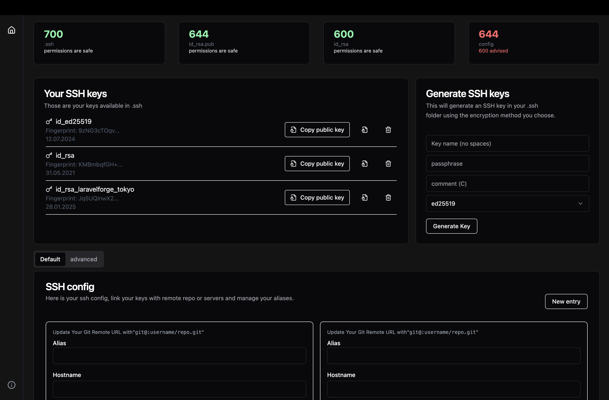

# SssSH editor🛠️  
*A minimal GUI for managing SSH configurations and keys, built with Electron, Vue, and Shadcn UI.*  

---

## Why This Exists ❓  
Editing SSH configs (`~/.ssh/config`) and managing keys is a repetitive task. 
After the 100th search for `ssh-add -K` , I built this tool to:

- 🖱️ **Replace terminal** with a clean GUI.  
- 🔑 Simplify **key management** (RSA, Ed25519) and **passphrase integration** with macOS Keychain and config file edition.
---

## Features ✨  
- **GUI SSH Config Editor**: Visualize, edit, and validate `~/.ssh/config` files.  
- **Key Management**: Generate, delete, and organize SSH keys.
- **macOS Keychain Integration**: Securely store passphrases without CLI hacks.  
- **Modern Stack**: Built with **Electron**, **Vue 3**, and **Shadcn UI**.  
---

## Installation 📦  
*Currently supports macOS Silicon (M1/M2/M3)*  

### Prerequisites  
- Node.js v20+  

### Build DMG
In order to build a DMG you can install on other Macbook than yours you'll need to notarize the exported DMG. To do that you can follow the [following steps to create your needed credentials](https://www.youtube.com/watch?v=hYBLfjT57hU) and fil-out the .env file with your informations. Also uncomment the lines in forge.config.js file to use osxNotarize.

### Want to improve this tool? Here’s how:
- 🐛 Report Bugs: Open an issue with steps to reproduce.
- 💡 Request Features: Share your ideas in Discussions.
- 🛠️ Submit PRs: Fix typos, add platforms, add new functionalities, improve code...

### Known issue
Tailwind 4 integration is not working correctly.